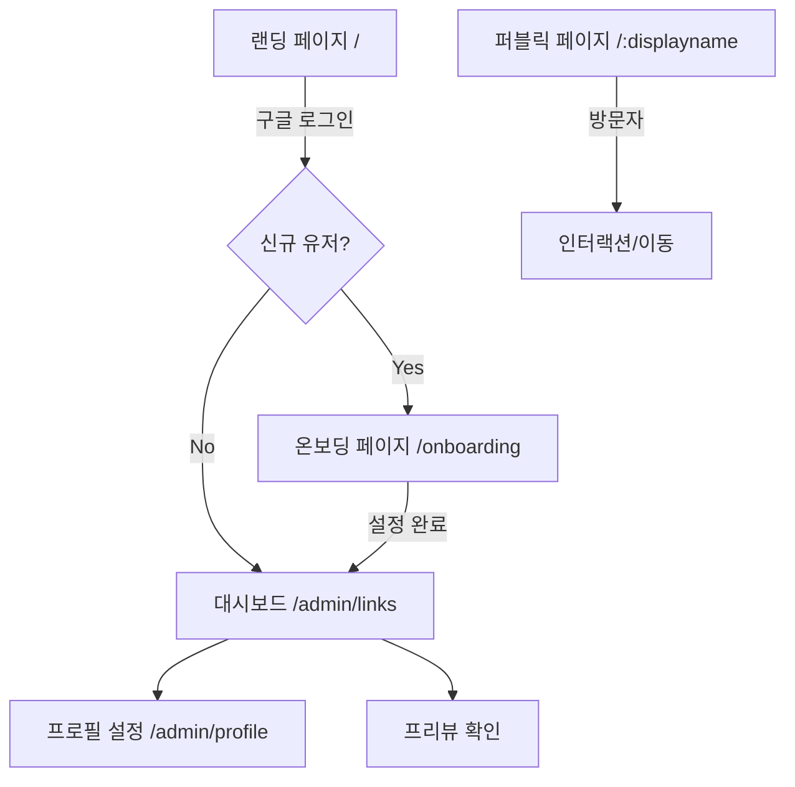
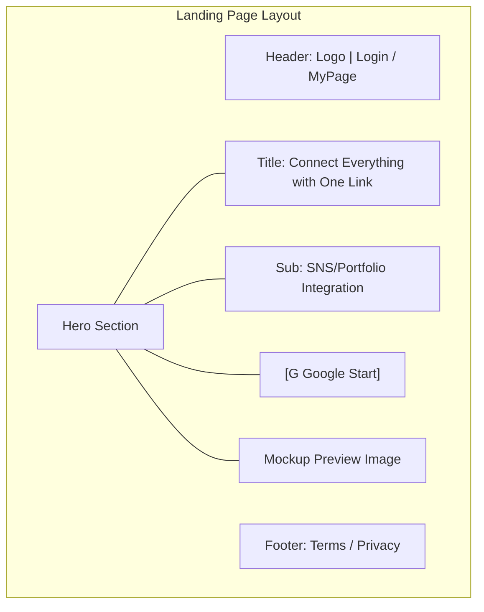
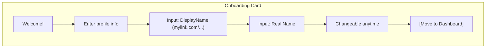
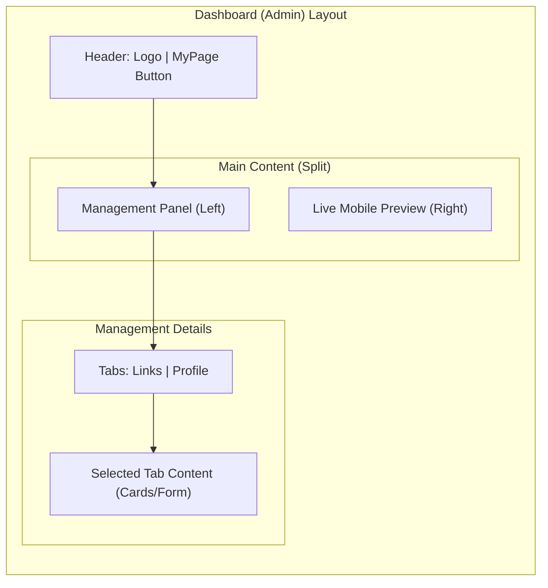
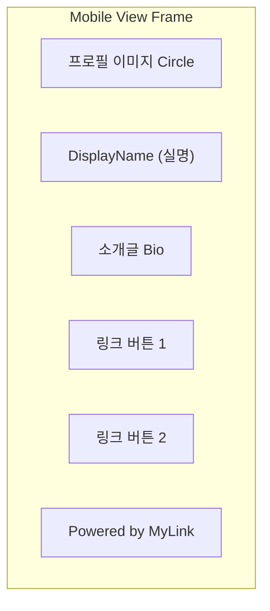

# 마이링크 (MyLink) - 화면별 와이어프레임 설계 (Wireframes)

이 문서는 마이링크 서비스의 주요 화면 구조를 시각화하여 정의합니다. `Mermaid` 다이어그램과 `ASCII Art`를 사용하여 레이아웃을 표현하며, 상세 명세는 `shadcn/ui` 컴포넌트 기준을 따릅니다.

---

## 1. 전체 서비스 흐름도 (Screen Flow)



---

## 2. 랜딩 페이지 (Landing Page)

*   **상단 네비게이션바 (Global Header)**
    *   좌측: MyLink 로고
    *   우측: 화면 우측 상단에 고정
        *   비로그인 시: `[로그인]` / `[무료로 시작하기]` 버튼
        *   로그인 시: `[마이페이지]` 버튼 (클릭 시 마이페이지/대시보드 진입)

### Mermaid Layout


### ASCII Wireframe
```text
+-------------------------------------------------------------+
| [LOGO] MyLink                        [로그인] / [마이페이지] |
+-------------------------------------------------------------+
|                                                             |
|           하나의 링크로 당신의 모든 것을 연결하세요             |
|        SNS, 포트폴리오를 1분 만에 통합 프로필로 제작           |
|                                                             |
|                   [ G Google로 시작하기 ]                    |
|                                                             |
|           +-----------------------+                         |
|           |       Mockup UI       |                         |
|           |       (Preview)       |                         |
|           +-----------------------+                         |
|                                                             |
+-------------------------------------------------------------+
```

---

## 3. 신규 가입 온보딩 화면 (`/onboarding`)

첫 로그인 직후 필수로 거쳐야 하는 화면입니다.

### Mermaid Layout


### ASCII Wireframe
```text
+-------------------------------------------------------------+
|                                                             |
|                     +-----------------+                     |
|                     |     Welcome!    |                     |
|                     +-----------------+                     |
|             당신을 나타낼 프로필 정보를 입력해주세요              |
|                                                             |
|          DisplayName (URL 주소)                               |
|          +---------------------------------------+          |
|          | mylink.com/ [ username              ] |          |
|          +---------------------------------------+          |
|                                                             |
|          사용자 실명                                         |
|          +---------------------------------------+          |
|          | [ 실제 이름을 입력하세요               ] |          |
|          +---------------------------------------+          |
|                                                             |
|          [!] 언제든지 자유롭게 변경 가능합니다.                   |
|                                                             |
|                   [ 대시보드로 이동 ]                        |
|                                                             |
+-------------------------------------------------------------+
```

---

## 4. 어드민 대시보드 (Admin Dashboard)

### Layout Structure
*   **2-Column Layout**: Left(Management), Right(Live Mobile Preview)

### Mermaid Layout


### ASCII Wireframe
```text
+---------------------------------------+---------------------+
| [LOGO] MyLink            [마이페이지] |    Live Preview     |
+---------------------------------------+---------------------+
| [링크] [프로필(마이페이지)]              |   +-------------+   |
+---------------------------------------+   |  (Mobile)   |   |
|                                       |   |   @User     |   |
| <프로필 탭 뷰>                          |   |             |   |
|  +---------------------------------+  |   | +---------+ |   |
|  | (Avatar) [사진 변경]             |  |   | | Link 1  | |   |
|  |                                 |  |   | +---------+ |   |
|  | ✎ DisplayName [ Input ]         |  |   | +---------+ |   |
|  | ✎ 사용자 실명   [ Input ]         |  |   | | Link 2  | |   |
|  | ✎ 소개글       [ Textarea ]      |  |   | +---------+ |   |
|  |                                 |  |   |             |   |
|  |               [프로필 저장]       |  |   +-------------+   |
|  +---------------------------------+  |                     |
+---------------------------------------+---------------------+
```

---

## 5. 퍼블릭 프로필 페이지 (Public Profile)

### 컴포넌트 구성 (Mobile First)



### ASCII Wireframe
```text
          [     Mobile Page     ]

                 +-------+
                 |  Img  |
                 +-------+
             DisplayName (실명)
               "소개글 영역"

          +-----------------------+
          |       Link Title      |
          +-----------------------+

          +-----------------------+
          |       Link Title      |
          +-----------------------+

          +-----------------------+
          |       Link Title      |
          +-----------------------+

              Powered by MyLink
```

---

## 6. 사용된 UI 컴포넌트 명세 (shadcn/ui)

*   **Button**: Primary(랜딩/저장), Ghost(삭제/로그아웃)
*   **Avatar**: 프로필 이미지 렌더링
*   **Input / Textarea**: 이름, URL, Bio 입력
*   **Switch**: 링크 활성화/비활성화 토글
*   **Card**: 대시보드 내 개별 링크 조작 블록
*   **Toast**: 저장 완료/링크 복사 완료 알림
*   **Dialog**: 링크 삭제 시 최종 확인 팝업
